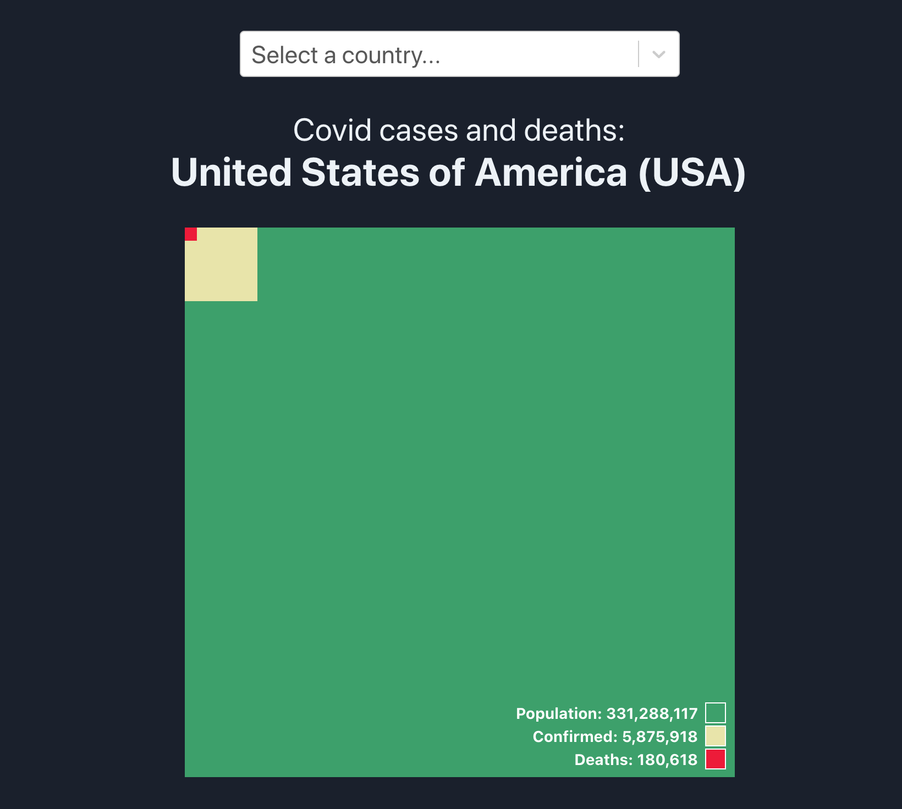

# Covid Square

[](https://app.netlify.com/sites/covid-square/deploys)


Visualize the number of Covid19 cases and deaths compared to the total population of a country.

[**Try it online on Netlify! 🚀**](https://covid-square.netlify.app)

<a href="https://covid-square.netlify.app">
  
</a>

## Run locally

This is a React app initialized via `create-react-app`. You can run it locally like this:

```
yarn start
```

## TODO

- [x] Add legend with the actual numbers
- [x] Give the app an A11y pass
- [ ] Add dark/light mode toggle
- [ ] Setup SSR
- [ ] Show when the information was last updated
- [ ] Use proper routing?
- [ ] Make it prettier (submit a PR if you have ideas!)

## Acknowledgements

* Inspired by [u/data-artist](https://www.reddit.com/r/dataisbeautiful/comments/ia4waq/oc_covid_cases_and_deaths_in_the_us_as_a)
* Data from [disease.sh](https://disease.sh)
