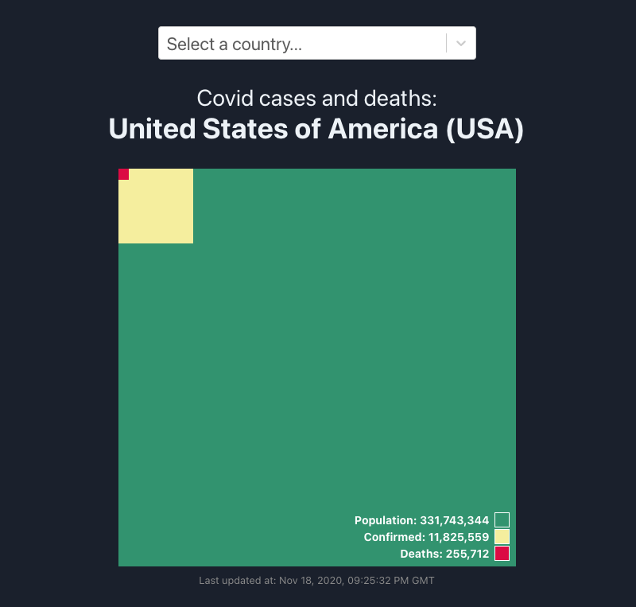

# Covid Square

Visualize the number of Covid19 cases and deaths compared to the total population of a country.

<a href="#">
  
</a>

## Run locally

This is a React app initialized via `create-react-app`. You can run it locally like this:

```
yarn start
```

## Acknowledgements

* Inspired by [u/data-artist](https://www.reddit.com/r/dataisbeautiful/comments/ia4waq/oc_covid_cases_and_deaths_in_the_us_as_a)
* Data from [disease.sh](https://disease.sh)
